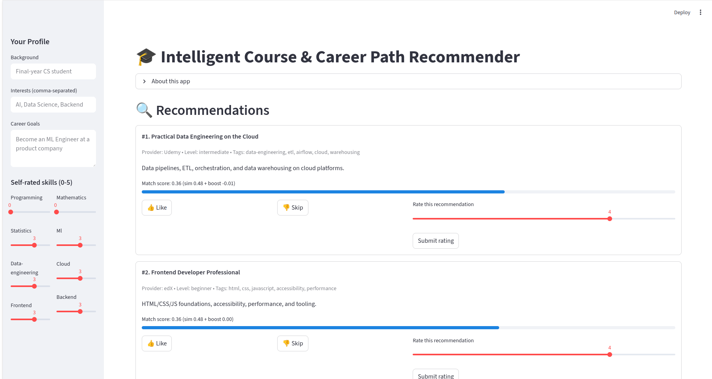
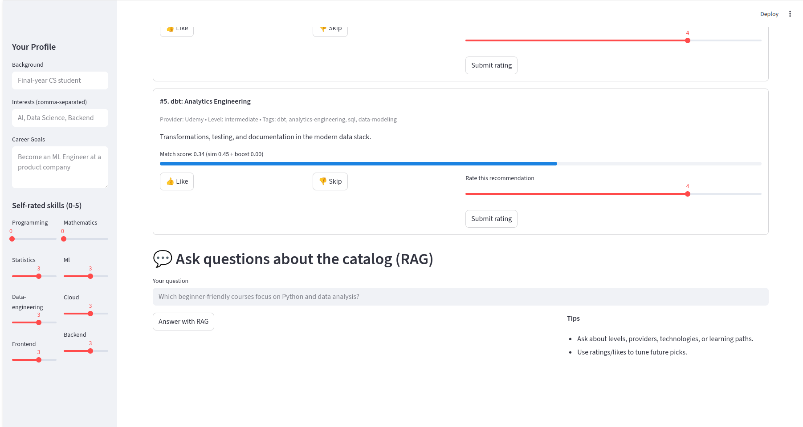

# 🎓 Intelligent Course & Career Path Recommender

A **single-file Streamlit app** that helps students discover the right learning resources and plan their career paths intelligently.  


---

## 🚀 Features
- 📝 Captures a student's **background, interests, goals, and self-rated skills**
- 🔍 Matches courses using **sentence-transformer embeddings + FAISS (cosine similarity)**
- 💬 Provides **retrieval-augmented QA** over the course catalog
- 🎯 **Learns from user feedback** (ratings + likes) to personalize recommendations over time



---

## 🛠️ Installation & Setup

### 1. Install dependencies
Requires **Python 3.9+**  
```bash
pip install streamlit sentence-transformers faiss-cpu openai tiktoken pydantic pandas numpy scikit-learn
```

### 2. (Optional) Set your OpenAI API key
For enabling **RAG-based answers**:
```bash
export OPENAI_API_KEY=your_key_here
```

### 3. Launch the app
```bash
streamlit run streamlit_app.py
```

---

## 📂 Notes & Customization
- If no `OPENAI_API_KEY` is set → the QA system falls back to **extractive summaries**.  
- You can replace the default in-memory dataset by providing a **CSV file** at:
  ```
  ./courses.csv
  ```
  with columns:
  - `title`
  - `provider`
  - `description`
  - `skill_level`
  - `tags` (comma-separated)
- User **feedback** is stored in:
  ```
  ./data/feedback.jsonl
  ```
- Personalized **profile state** is stored in:
  ```
  ./data/profile_state.json
  ```

---

## 🧩 Tech Stack
- [Streamlit](https://streamlit.io/) – UI framework
- [Sentence Transformers](https://www.sbert.net/) – embeddings
- [FAISS](https://faiss.ai/) – similarity search
- [OpenAI API](https://platform.openai.com/) – retrieval-augmented generation (optional)
- [Pandas / NumPy / scikit-learn] – data processing & personalization logic

---

## 📌 Roadmap
- 🔧 Add support for **multi-user profiles**
- 📊 Dashboard for progress & skill tracking
- 🌐 Integrate with external **MOOC APIs** (Coursera, edX, Udemy, etc.)
- 🤝 Smarter personalization with **reinforcement learning**

---

## 🤝 Contributing
Pull requests and suggestions are welcome! Please open an issue to discuss before making major changes.

---

## 📜 License
MIT License © 2025  
